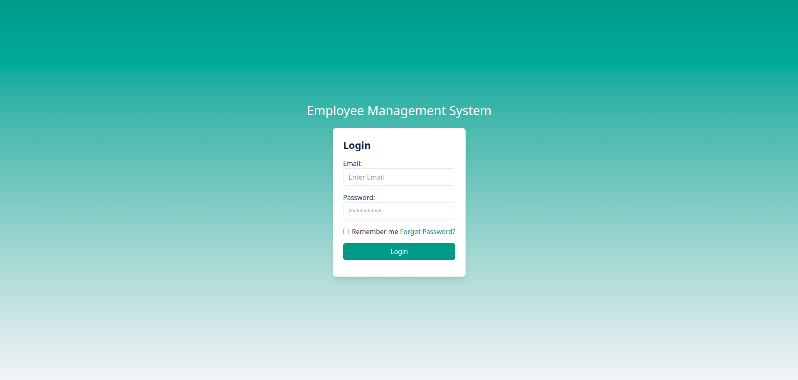
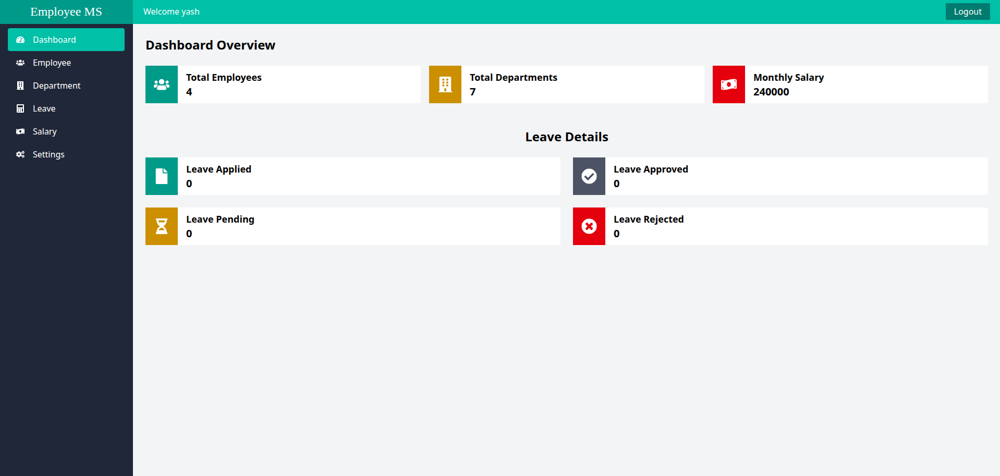

# Employee Management System (EMS)

A production-ready **full-stack** Employee Management System built with **React (Vite) + Tailwind CSS** on the frontend and **Node.js + Express + MongoDB (Mongoose)** on the backend. It supports secure authentication, role-based access, and complete CRUD flows for employees, departments, leaves, and salaries.

---

## ✨ Features

- JWT-based **authentication & authorization** (Admin / Employee)
- **Employee management**: create, update, list, delete
- **Department management** with cascading deletes
- **Leave requests** with statuses (Pending / Approved / Rejected)
- **Salaries** with net salary fields
- **Responsive UI** built with Tailwind CSS
- Clean, modular server architecture (controllers, routes, models, middleware)

---

## 🧱 Tech Stack

- **Frontend:** React (Vite), Tailwind CSS, Axios  
- **Backend:** Node.js, Express.js, Mongoose  
- **Database:** MongoDB (local or Atlas)

---

## 📁 Project Structure

```bash
Employee-Management-System/
│
├─ frontend/               # React + Vite + Tailwind
│  ├─ src/
│  │  ├─ components/
│  │  ├─ pages/
│  │  ├─ context/
│  │  └─ utils/
│  └─ public/
│
├─ server/                 # Node + Express + Mongoose
│  ├─ controllers/
│  ├─ db/
│  ├─ middleware/
│  ├─ models/              
│  ├─ routes/
│  ├─ public/
│  ├─ index.js
│  └─ userSeed.js          
│
└─ README.md
```

---

## ✅ Prerequisites

- Node.js **18+**
- MongoDB (local **or** MongoDB Atlas connection string)

---

## 🚀 Local Setup

### 1) Clone
```bash
git clone https://github.com/Cipher-bhai/ems
cd ems
```

### 2) Install dependencies
```bash
# frontend
cd frontend
npm install

# backend
cd ../server
npm install
```

### 3) Environment variables (server/.env)
```env
PORT=3000
MONGODB_URL=mongodb://localhost:27017/ems   # or your Atlas URI
JWT_KEY=your_strong_jwt_secret
```

### 4) Run the app
```bash
# in one terminal: backend
cd server
npm start

# in another terminal: frontend
cd frontend
npm run dev
```
- Frontend dev server (Vite) defaults to **http://localhost:5173**
- Backend defaults to **http://localhost:3000**

---

## 🌱 (Optional) Seed an Admin User

Update credentials in `server/userSeed.js` if needed, then run:
```bash
cd server
node userSeed.js
```
> This script creates **one** admin user. Run it once (re-running without changes may create duplicates unless you add a check).

---

## 🗂️ Data Models (high level)

- **User**: `name`, `email`, `password (hashed)`, `role (admin|employee)`, `profileImage`, timestamps  
- **Department**: `dep_name`, `description`, timestamps (+ pre-hook to cascade delete related data)  
- **Employee**: `userId`, `employeeId`, `dob`, `gender`, `maritalStatus`, `designation`, `department`, `salary`, timestamps  
- **Leave**: `employeeId`, `leaveType`, `startDate`, `endDate`, `reason`, `status`, timestamps  
- **Salary**: `employeeId`, `basicSalary`, `allowances`, `deductions`, `netSalary`, `payDate`, timestamps

---

## 🔒 Security Notes

- **Never commit** `.env` files or secrets.  
- Passwords are **hashed** with bcrypt.  
- Keep `JWT_KEY` long and random.

---

## 🖼 Screenshots

<p align="center">
  
</p>

<p align="center">
  
</p>

---

## 🧪 Useful Scripts

```bash
# Frontend
npm run dev        # Vite dev server
npm run build      # Production build (outputs to frontend/dist)

# Backend
npm start          # Start server
# (Optionally add nodemon in package.json for hot reloads)
```

---

## 🤝 Contributing

1. Fork the repo  
2. Create a branch: `git checkout -b feature/your-feature`  
3. Commit: `git commit -m "feat: add your feature"`  
4. Push: `git push origin feature/your-feature`  
5. Open a Pull Request

---

## 📄 License

This project is licensed under the **MIT License**.  
See the [LICENSE](LICENSE) file for details.
